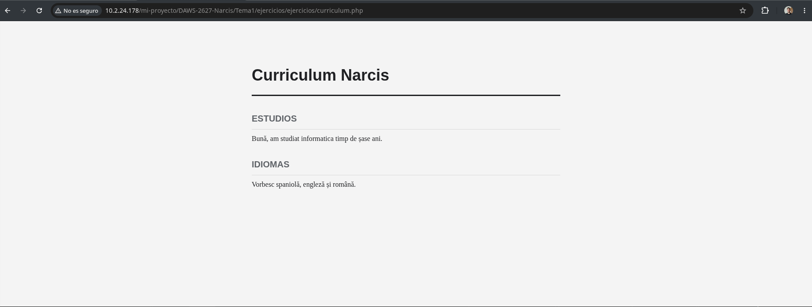
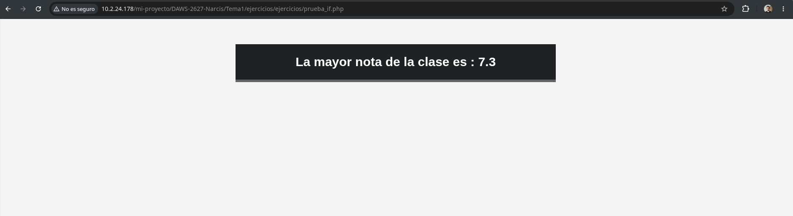

# **DAWS-2627 💻**
## **Ejercicio 1 👋**
Este es el ejercicio 1 que conta con un apartado para ver el nombre del creador del ejercicio practicando un saludo en php


## **Ejercicio 2 📝**
Este es el ejercicio 2 que conta con un pequeño curriculum descriptivo con los idiomas que manejo y mis estudios de manera resumida.



## **Ejercicio 3 ⭕**
Este es un ejercicio en el que podemos observar como se pueden crear constantes y operar con las mismas por ejemplo para calcular el área de una circunferencia.


## **Ejercicio 4 ❓**
```
<?php
    $num1 = 3;
    $num2 = 5;
    $num3 = 8;
    $num1 *= 4;
    
    echo $num1; --> Imprime 12
    echo $num1 <= $num2; --> Imprime false.
    echo $num3 > $num1 and $num3 > $num2; --> Imprime false
    echo $num3 > $num1 or $num3 > $num2; --> Imprime true
    echo $num1 > $num2 xor $num1 > $num3; --> Imprime false
    
    $num3--;
    echo $num3; --> Imprime 7
    
    $num3 += $num1;
    echo $num3; --> Imprime 19
?>
```
*1* La primera instrucción de echo que podemos ver en el fragmento de codigo imprimiria el numero 12 ya que en la variable $num1 vemos que se guarda el valor previo (3) multiplicado por 4.

*2* La segunda instrucción echo da como resultado false pero en php no imprime realmente nada ya que 12 no es mayor o igual a 5.

*3* La tercera instrucción de echo al igual que la anterior valdrá false pero al igual que antes no imprime nada
Con la puerta lógica de and unicamente con que una sea falsa la condición completa será false.

*4* La cuarta instrucción de echo que podemos ver en el fragmento de codigo imprimiría 1 ya que en el caso de verdadero en php se imprime el número 1 en la puerta lógica de or es suficiente que una sea verdadera para que la condición sea totalmente verdadera en este caso la primera no lo es pero la segunda si.

*5* En la quinta instrucción del echo visualizamos que usa de puerta lógica XOR; que conlleva esto? que para que la condición sea verdadera tiene que haber una condicion falsa y otra verdadera. El resultado seria false ya que las 2 condiciónes previas son verdaderas.

*6* En la sexta instrucción de echo lo que dice ahora esque va a imprimir el valor de la variable $num3. En la anterior instrucción le estamos restando 1 al valor original de $num3 y guardandola en la misma, así que imprimiría el numero 7.

*7* En la última instrucción de echo podemos ver que vuelve a imprimir el valor de $num3 pero en la instrucción de antes en este caso hace que en la variable se guarde su contenido mas el contenido de la variable $num1(12) así que el resultado de la impresión seria 19.

## **Ejercicio 5**
Este es un ejercicio de prueba de funcionamiento del if , siguiendo una logica de 2 notas y determina cual de ellas es la mayor nota. 


```
<?php
        $nota1= 7.132;
        $nota2= 7.3;
        $mayor;

        if($nota1 > $nota2){
            $mayor = $nota1;
        }else {
            $mayor = $nota2;
        }
    ?>


```
En el codigo podemos ver las 2 variables llamadas nota1 y nota2 y mediante una variable auxiliar llamada mayor guardamos el mayor valor con una condicional.
